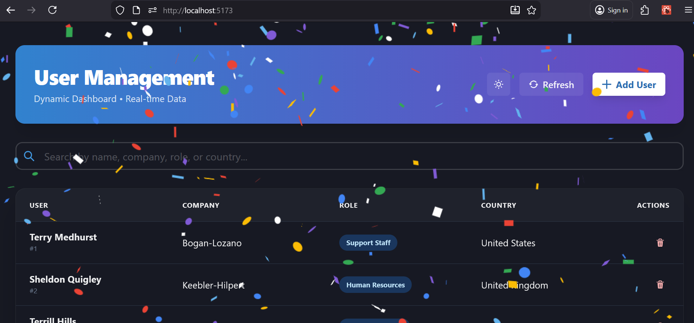
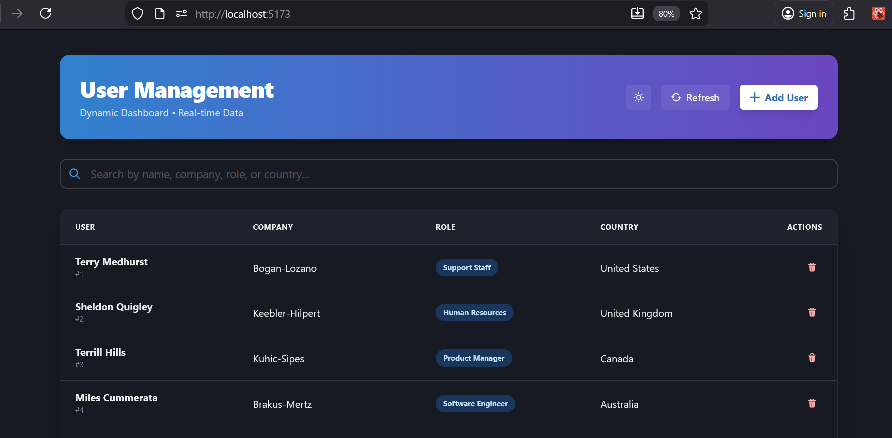
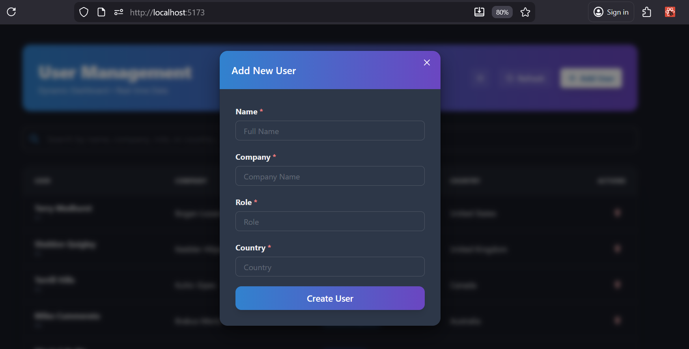
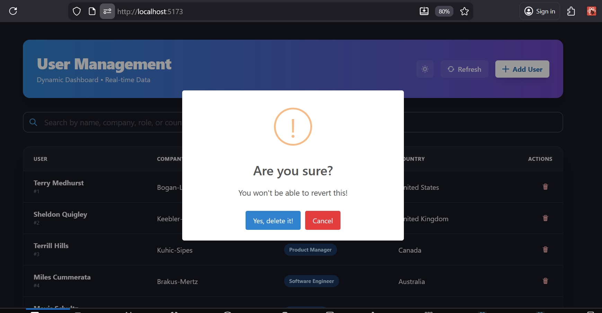
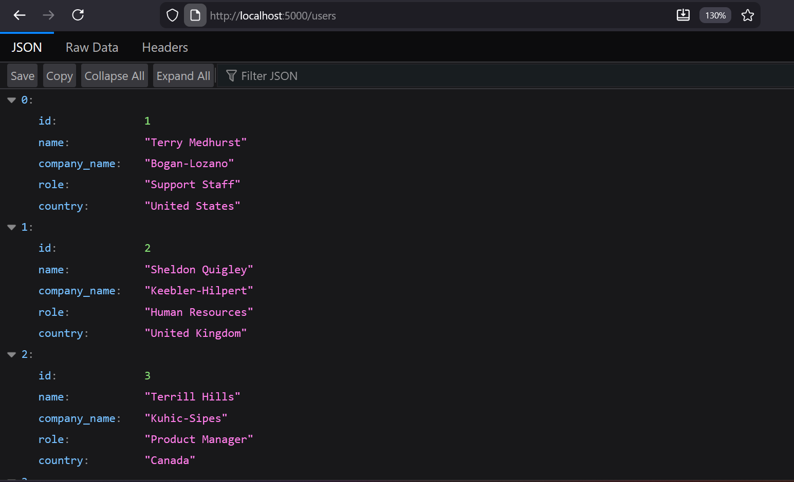

# React & Node.js User Management System

A full-stack user management application built with React (Vite + Chakra UI) and Node.js (Express + MySQL).

##  Features

- **User Listing**: Fetch and display users from a MySQL database.
- **Add User**: Add new users with real-time local state updates.
- **Delete User**: Soft/Hard delete functionality with confirmation alerts.
- **Search & Filter**: Real-time filtering across all user fields.
- **Responsive UI**: Built with Chakra UI for a modern, mobile-friendly experience.
- **SweetAlert2**: Beautiful confirmation dialogs for user actions.

## 📸 Screenshots

<div align="center">
  <h3>🎉 Landing Celebration</h3>
  
  <br/><br/>

  <h3>User List Page</h3>
  
  <br/><br/>
  
  <h3>Add New User</h3>
  
  <br/><br/>

  <h3>Delete Confirmation</h3>
  
  <br/><br/>

  <h3>Soft Delete Success</h3>
  
  <br/><br/>

  <h3>Backend API Structure</h3>
  
</div>

## 🛠️ Project Structure

- `/frontend`: React application (Vite + Chakra UI)
- `/backend`: Node.js Express API (MySQL)
- `/screenshots`: UI demonstration images

## ⚙️ Installation & Setup

### 1. Backend Setup
1. Navigate to `/backend`: `cd backend`
2. Install dependencies: `npm install`
3. Configure your MySQL credentials in `.env`:
   ```env
   DB_HOST=localhost
   DB_USER=root
   DB_PASSWORD=your_password
   DB_NAME=user_management
   ```
4. Initialize the database: Run `schema.sql` in your MySQL client or use `node setup_db.js`.
5. Start the server: `node server.js`

### 2. Frontend Setup
1. Navigate to `/frontend`: `cd frontend`
2. Install dependencies: `npm install`
3. Start the development server: `npm run dev`
4. Open the application at `http://localhost:5173`.

## 📝 Implementation Details

- **Frontend**: Utilizes local state management for Add/Delete operations as per the interview requirements, providing immediate UI feedback.
- **Backend**: Robust Express API integrated with MySQL for data persistence.
- **Search**: Optimized real-time filtering that works across all user attributes.
